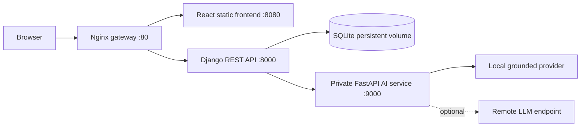

# UniFlow

**UniFlow** is a role-aware university management platform that combines academic operations, governed institutional knowledge, workflow automation, notifications, reporting, and grounded AI-assisted question answering in one responsive web application.

This repository contains the complete frontend, backend, private AI service, reverse-proxy configuration, automated tests, and Docker deployment configuration required to run the system from end to end.

## Table of contents

1. [Core capabilities](#core-capabilities)
2. [Architecture](#architecture)
3. [Technology stack](#technology-stack)
4. [Roles and access model](#roles-and-access-model)
5. [Repository structure](#repository-structure)
6. [Prerequisites](#prerequisites)
7. [Quick start with Docker](#quick-start-with-docker)
8. [Configuration](#configuration)
9. [Demo data](#demo-data)
10. [Local development](#local-development)
11. [Frontend production build](#frontend-production-build)
12. [Testing and quality checks](#testing-and-quality-checks)
13. [End-to-end verification](#end-to-end-verification)
14. [Knowledge upload and grounded AI](#knowledge-upload-and-grounded-ai)
15. [API overview](#api-overview)
16. [Production deployment](#production-deployment)
17. [Data persistence and backup](#data-persistence-and-backup)
18. [Troubleshooting](#troubleshooting)
19. [Security notes](#security-notes)

---

## Core capabilities

### Identity and authorization

- JWT access and refresh tokens
- Refresh-token rotation and token blacklisting
- Role-based access control and object-level authorization
- Account lockout and request throttling
- User activation, deactivation, reactivation, and role assignment
- Role-aware navigation and protected frontend routes

### Academic operations

- Courses and class sections
- Professor-owned class editing
- Enrollment management with duplicate and capacity validation
- Exams and grades
- Student-only grade visibility
- Professor class-performance reports containing:
  - enrolled students
  - each student's grade
  - students without grades
  - class average
  - minimum and maximum grades
  - recorded feedback
- Degree-progress tracking, academic goals, recommendations, and schedule suggestions

### Knowledge management

- Governed institutional documents
- File upload and text extraction
- Supported uploads: `.txt`, `.md`, `.csv`, `.json`, `.pdf`, `.docx`, `.docm`, `.html`, and `.htm`
- Document publishing, archiving, restoration, and reindexing
- Revision history and version restoration
- Access levels and role restrictions
- Governance dates, review ownership, tags, and expiration status
- JSON and CSV import/export

### Grounded AI

- Retrieval only from authorized, published, AI-enabled knowledge
- English and Persian token normalization
- Relevant-passage selection for long documents
- Source citations and confidence scoring
- Local deterministic provider for offline development
- Optional remote-provider adapter
- Human-answer escalation and answer feedback

### University operations

- Configurable workflow request types
- Dynamic forms, assignment, transitions, history, and optimistic concurrency
- Notifications, unread counts, preferences, actions, digest, and broadcasts
- Role-specific dashboards and analytics
- Calendar, global search, activity feed, feedback center, and user preferences
- Light/dark appearance and responsive layouts

---

## Architecture



Only the gateway is published to the host in the default Docker setup. The backend, frontend service, database volume, and AI service communicate on a private Docker network.

### Request flow

1. The browser loads the React application through Nginx.
2. Requests under `/api/` are proxied to Django REST Framework.
3. Django authenticates the user and applies permission and object-level checks.
4. For grounded questions, Django retrieves only documents visible to that user.
5. Authorized passages are sent to the private AI service.
6. The response is returned with confidence information and source references.

---

## Technology stack

| Layer | Technology |
|---|---|
| Frontend | React 19, TypeScript, Vite, Redux Toolkit, RTK Query, React Router, React Hook Form, Zod |
| UI | Custom responsive CSS, Geist Variable font, Lucide icons, light/dark themes |
| Backend | Python 3.12, Django 5.2, Django REST Framework, Simple JWT |
| AI service | FastAPI, Pydantic, HTTPX, local or remote provider abstraction |
| Storage | SQLite in a persistent Docker volume |
| Gateway | Nginx 1.27 Alpine |
| Testing | Pytest, pytest-django, Vitest, React Testing Library, Playwright |
| Deployment | Docker and Docker Compose v2 |

---

## Roles and access model

| Role | Primary capabilities |
|---|---|
| Student | View own academics and grades, ask questions, read permitted knowledge, submit requests, view notifications |
| Professor | Student capabilities plus manage own classes, view enrollments, record grades, and view class reports |
| Administrative Staff | Manage users, documents, workflows, academic records, questions, broadcasts, reports, and feedback |
| University President | Full platform permissions, analytics, audit visibility, and management access |

The backend is the source of truth for authorization. Hiding a control in the frontend does not replace server-side permission checks.

---

## Repository structure

```text
.
├── .env.example
├── docker-compose.yml
├── docker-compose.prod.yml
├── README.md
├── .github/
│   └── workflows/
│       ├── quality.yml       # Backend, AI, frontend, and Compose quality checks
│       └── e2e.yml           # Playwright Docker E2E pipeline
├── e2e/
│   ├── pages/               # Page objects
│   ├── support/             # Authentication helpers and test credentials
│   ├── tests/               # Browser-level acceptance tests
│   ├── docker-compose.e2e.yml
│   ├── playwright.config.ts
│   └── package.json
├── backend/
│   ├── apps/                 # Django domain applications
│   ├── config/               # Django settings and URL configuration
│   ├── docker/entrypoint.sh  # Runtime migration and seed entrypoint
│   ├── requirements/         # Development and production dependencies
│   ├── tests/                # Backend API and domain tests
│   ├── Dockerfile
│   └── manage.py
├── ai-service/
│   ├── api/                  # FastAPI application and provider layer
│   ├── tests/                # AI-service tests
│   ├── Dockerfile
│   ├── requirements.txt      # Runtime dependencies
│   └── requirements-dev.txt  # Test and lint dependencies
├── frontend/
│   ├── src/                  # React application source
│   ├── public/               # Static public assets
│   ├── docker/nginx.conf     # Static frontend server configuration
│   ├── Dockerfile            # Multi-stage Node.js and Nginx image
│   ├── package.json
│   └── vite.config.ts
└── nginx/
    ├── nginx.conf            # Gateway-level Nginx configuration
    └── conf.d/default.conf   # API and frontend proxy routes
```

---

## Prerequisites

### Recommended Docker workflow

- Docker Desktop or Docker Engine
- Docker Compose v2 (`docker compose`)
- At least 4 GB of available memory
- Port 80 available, or another port configured through `HTTP_PORT`

### Local development and E2E workflow

- Python 3.12
- Node.js 22 LTS or newer
- npm 10 or newer
- Chromium installed through Playwright for browser tests

Verify the tools:

```bash
docker --version
docker compose version
python --version
node --version
npm --version
```

---

## Quick start with Docker

### 1. Open the project directory

PowerShell:

```powershell
cd C:\path\to\smart-university-management-system
```

macOS/Linux:

```bash
cd /path/to/smart-university-management-system
```

### 2. Create the environment file

PowerShell:

```powershell
Copy-Item .env.example .env
```

macOS/Linux:

```bash
cp .env.example .env
```

For local development, the supplied defaults are usable. Before any shared or production deployment, replace the secret values.

### 3. Build and start the system

```bash
docker compose up --build -d
```

The backend container automatically performs the following when enabled in `.env`:

1. database migrations
2. system role and permission seeding
3. optional demo-data seeding
4. static-file collection
5. Gunicorn startup

### 4. Check service status

```bash
docker compose ps
```

All services should be running, and the backend and AI service should become healthy.

### 5. Open UniFlow

```text
http://localhost
```

When `HTTP_PORT` is changed, use that port instead, for example:

```text
http://localhost:8088
```

### 6. Verify health endpoints

PowerShell:

```powershell
curl.exe http://localhost/gateway-health
curl.exe http://localhost/healthz
curl.exe http://localhost/api/v1/health
```

macOS/Linux:

```bash
curl http://localhost/gateway-health
curl http://localhost/healthz
curl http://localhost/api/v1/health
```

Expected gateway result:

```text
ok
```

### 7. View logs

```bash
docker compose logs -f --tail=100
```

Service-specific examples:

```bash
docker compose logs -f backend
docker compose logs -f ai-service
docker compose logs -f frontend
docker compose logs -f nginx
```

### 8. Stop or remove the containers

Stop without removing containers:

```bash
docker compose stop
```

Restart stopped containers:

```bash
docker compose start
```

Remove containers while preserving the database volume:

```bash
docker compose down
```

Reset containers and delete all persisted application data:

```bash
docker compose down -v
docker compose up --build -d
```

> `docker compose down -v` permanently removes the local database volume.

---

## Configuration

The root `.env` file is consumed by Docker Compose.

### Main Docker configuration

| Variable | Development default | Purpose |
|---|---:|---|
| `DJANGO_SECRET_KEY` | required placeholder | Django cryptographic secret; replace before deployment |
| `DJANGO_DEBUG` | `1` | Enables development behavior |
| `DJANGO_ALLOWED_HOSTS` | `localhost,127.0.0.1,backend` | Accepted HTTP hostnames |
| `CORS_ALLOWED_ORIGINS` | `http://localhost` | Browser origins allowed by the API |
| `CSRF_TRUSTED_ORIGINS` | `http://localhost` | Trusted CSRF origins |
| `AI_SERVICE_API_KEY` | required placeholder | Shared private key between Django and the AI service |
| `AI_PROVIDER` | `local` | `local` for grounded offline responses or `remote` for an external provider |
| `AI_RETRIEVAL_STRATEGY` | `hybrid` | Backend retrieval strategy |
| `HTTP_PORT` | `80` | Host port exposed by the gateway |
| `AUTO_MIGRATE` | `1` | Runs migrations at backend startup |
| `AUTO_SEED_SYSTEM` | `1` | Ensures system roles and permissions exist |
| `AUTO_SEED_DEMO` | `1` | Creates demonstration users and sample data in debug mode |
| `SESSION_COOKIE_SECURE` | `0` | Set to `1` behind HTTPS |
| `CSRF_COOKIE_SECURE` | `0` | Set to `1` behind HTTPS |
| `SECURE_SSL_REDIRECT` | `0` | Redirects HTTP to HTTPS when enabled |
| `SECURE_HSTS_SECONDS` | `0` | HSTS duration; enable only after HTTPS is correctly configured |

### Additional backend variables

The backend also supports the variables documented in `backend/.env.example`, including:

- `SQLITE_DB_PATH`
- `AI_SERVICE_URL`
- `AI_SERVICE_TIMEOUT_SECONDS`
- `AI_CONFIDENCE_THRESHOLD`
- `LOGIN_MAX_ATTEMPTS`
- `ACCOUNT_LOCK_MINUTES`
- authentication and AI throttle rates
- upload and extracted-text limits
- logging level

### Remote AI provider

Set these variables for a compatible remote endpoint:

```env
AI_PROVIDER=remote
LLM_API_URL=https://provider.example/v1/answer
LLM_API_KEY=replace-me
LLM_MODEL=your-model
```

The remote endpoint must accept the request shape implemented in `ai-service/api/providers.py` and return an `answer` field, with optional `confidence`.

### Using a non-default local port

Example `.env`:

```env
HTTP_PORT=8088
CORS_ALLOWED_ORIGINS=http://localhost:8088
CSRF_TRUSTED_ORIGINS=http://localhost:8088
```

Restart after changing `.env`:

```bash
docker compose down
docker compose up --build -d
```

---

## Demo data

When both conditions are true:

```env
DJANGO_DEBUG=1
AUTO_SEED_DEMO=1
```

the backend creates development-only sample users and academic data.

| Role | Username | Password |
|---|---|---|
| Student | `student` | `Student123!` |
| Professor | `professor` | `Professor123!` |
| Administrative Staff | `staff` | `Staff123!` |
| University President | `president` | `President123!` |

These credentials are intentionally not displayed on the login page. Disable demo seeding for any non-local environment:

```env
AUTO_SEED_DEMO=0
```

System-only seed command:

```bash
python manage.py seed_initial_data --system-only
```

Full development seed command:

```bash
python manage.py seed_initial_data
```

The full seed command is blocked outside debug mode unless explicitly allowed.

---

## Local development

Run the three application services in separate terminals.

### 1. AI service

PowerShell:

```powershell
cd ai-service
py -3.12 -m venv .venv
.\.venv\Scripts\Activate.ps1
python -m pip install --upgrade pip
pip install -r requirements.txt
$env:AI_SERVICE_API_KEY = "local-ai-internal-key"
$env:AI_PROVIDER = "local"
uvicorn api.main:app --reload --host 0.0.0.0 --port 9000
```

macOS/Linux:

```bash
cd ai-service
python3.12 -m venv .venv
source .venv/bin/activate
python -m pip install --upgrade pip
pip install -r requirements.txt
export AI_SERVICE_API_KEY=local-ai-internal-key
export AI_PROVIDER=local
uvicorn api.main:app --reload --host 0.0.0.0 --port 9000
```

Endpoints:

```text
http://localhost:9000/health
http://localhost:9000/docs
```

### 2. Django backend

PowerShell:

```powershell
cd backend
py -3.12 -m venv .venv
.\.venv\Scripts\Activate.ps1
python -m pip install --upgrade pip
pip install -r requirements\development.txt

$env:DJANGO_SECRET_KEY = "local-development-key-change-me"
$env:DJANGO_DEBUG = "1"
$env:DJANGO_ALLOWED_HOSTS = "localhost,127.0.0.1,testserver"
$env:CORS_ALLOWED_ORIGINS = "http://localhost:3000"
$env:AI_SERVICE_URL = "http://localhost:9000"
$env:AI_SERVICE_API_KEY = "local-ai-internal-key"

python manage.py migrate
python manage.py seed_initial_data
python manage.py runserver 0.0.0.0:8000
```

macOS/Linux:

```bash
cd backend
python3.12 -m venv .venv
source .venv/bin/activate
python -m pip install --upgrade pip
pip install -r requirements/development.txt

export DJANGO_SECRET_KEY=local-development-key-change-me
export DJANGO_DEBUG=1
export DJANGO_ALLOWED_HOSTS=localhost,127.0.0.1,testserver
export CORS_ALLOWED_ORIGINS=http://localhost:3000
export AI_SERVICE_URL=http://localhost:9000
export AI_SERVICE_API_KEY=local-ai-internal-key

python manage.py migrate
python manage.py seed_initial_data
python manage.py runserver 0.0.0.0:8000
```

Backend health:

```text
http://localhost:8000/api/v1/health
```

Django administration:

```text
http://localhost:8000/admin/
```

### 3. React frontend

```bash
cd frontend
npm ci
npm run dev
```

Open:

```text
http://localhost:3000
```

Vite proxies `/api` to `http://localhost:8000` during development.

---

## Frontend production build

The frontend Docker image builds the React application from source using a multi-stage Node.js and Nginx Dockerfile. A committed or manually generated frontend bundle is not required. From a clean clone, Docker performs the production build automatically:

```bash
docker compose build --no-cache frontend
docker compose up -d frontend nginx
```

To verify the production build directly during frontend development:

```bash
cd frontend
npm ci
npm run build
```

The generated local build output is ignored by Git. After rebuilding the container, hard-refresh the browser:

- Windows/Linux: `Ctrl + F5`
- macOS: `Cmd + Shift + R`

The login page uses its original responsive, scrollable behavior so content remains accessible at small viewport heights and browser zoom levels.

---

## Testing and quality checks

The repository includes automated backend, AI-service, frontend component, and browser-level end-to-end tests.

### Backend

```bash
cd backend
python -m venv .venv
```

Activate the environment, then run:

```bash
pip install -r requirements/development.txt
python manage.py check
python manage.py makemigrations --check --dry-run
ruff format --check .
ruff check .
pytest -q
pytest -q --cov=apps --cov-report=term-missing --cov-fail-under=70
```

Coverage includes authentication, roles, user creation, student registration, documents, Word extraction, revisions, grounded Q&A, workflows, notifications, academics, grading, reports, and security behavior.

### AI service

```bash
cd ai-service
python -m venv .venv
```

Activate the environment, then run:

```bash
pip install -r requirements-dev.txt
pytest -q
ruff format --check .
ruff check .
```

The runtime container installs only `requirements.txt`; test and lint tools are isolated in `requirements-dev.txt`. The AI tests cover health, internal API-key enforcement, grounded responses, confidence behavior, request limits, request analysis, and relevant-passage selection.

### Frontend

```bash
cd frontend
npm ci
npm run typecheck
npm run lint
npm test
npm run build
```

The frontend tests cover authentication state, protected routes, modal focus behavior, Escape handling, close buttons, and backdrop closing.

### Watch mode

```bash
cd frontend
npm run test:watch
```

---

## End-to-end verification

The `e2e/` package is a focused Playwright release suite for the highest-risk UniFlow journeys. It exercises the real React application through the browser and crosses the Nginx gateway, Django REST API, SQLite test database, FastAPI AI service, and seeded role model. Backend behavior is not mocked.

The suite is intentionally selective rather than exhaustive. Unit, component, and API tests remain responsible for detailed code-path coverage; the browser suite verifies that critical components work together from a user's point of view.

### Test strategy

| Testing concept | How UniFlow applies it |
|---|---|
| Verification | TypeScript compilation, existing unit/component/API suites, route and permission assertions, and exact contract checks verify the implementation against its technical design. |
| Validation | Browser journeys validate that students, professors, and staff can complete the real tasks the platform is intended to support. |
| Black-box testing | Playwright drives visible controls and compares observable outcomes without calling internal implementation functions. |
| System and release testing | Tests run against the assembled multi-service application in an isolated Docker environment. |
| Positive testing | Valid login, student registration, enrollment, grading, DOCX ingestion, revision creation, question answering, and workflow approval are covered. |
| Negative testing | Invalid credentials, unauthorized routes, duplicate student numbers, unsupported uploads, and scores above the accepted range are rejected safely. |
| Equivalence partitioning | Representative valid and invalid input classes are used for credentials, student identity, file type, role access, and grade values. |
| Boundary-value analysis | The grading flow explicitly checks the upper boundary by rejecting `100.01` before accepting a valid score. |
| Decision-table testing | A role matrix verifies navigation and capabilities for Student, Professor, Administrative Staff, and President. |
| State-transition testing | A leave request is verified through `pending → under review → approved`. Document revision history is also checked from version 1 to version 2. |
| Regression testing | Previously reported modal focus, Escape, close-button, backdrop, and body-scroll defects have dedicated repeatable browser tests. |
| Risk-based testing | Authentication, authorization, stored academic results, document ingestion, grounded answers, and workflow state changes receive priority. |
| Non-functional testing | Critical WCAG accessibility violations and mobile horizontal overflow are checked on representative pages. |

Passing tests demonstrate the expected behavior for the tested scenarios; they do not prove that the software is free of every possible defect.

### Covered scenarios

The suite currently defines **20 browser checks** across desktop and mobile Chromium:

1. gateway and backend health
2. UniFlow browser title and secure login presentation
3. absence of demo credentials on the login page
4. rejection of invalid credentials
5. guest redirection from protected routes
6. valid professor login and logout
7. critical accessibility checks for login and dashboard
8. mobile login and navigation without horizontal overflow
9. role-based navigation for all four seeded roles
10. direct-route denial for an unauthorized student
11. professor-only class and grading actions
12. modal focus preservation during controlled rerenders
13. modal closing with Escape and the explicit close control
14. safe backdrop closing and restoration of document scrolling
15. rejection of unsupported knowledge-file types
16. DOCX upload, extraction, indexing, and visible governed content
17. document revision creation and version-history verification
18. grounded student Q&A with the uploaded document as a visible source
19. student registration, duplicate-number rejection, enrollment, class editing, grade-boundary validation, enrollment-based student lookup, grading, report statistics, feedback, and student privacy
20. leave-request state transitions from submission through administrative approval

### Test isolation

`npm run test:docker` uses a dedicated Compose project and disposable volume. Each run:

- builds the frontend image from the current source through the multi-stage Dockerfile
- removes any previous `uniflow-e2e` containers and data
- starts the application on `http://127.0.0.1:8088`
- seeds deterministic system and demo records
- increases only the isolated test stack's throttling limits
- waits for the gateway health endpoint
- runs Playwright with one worker to keep stateful journeys deterministic
- captures diagnostics on failure
- removes the containers and volume after completion

Production throttling and runtime configuration are not changed.

### Install E2E dependencies

From the repository root:

```bash
cd e2e
npm ci
npx playwright install --with-deps chromium
npm run typecheck
```

Docker Desktop must be running before the isolated suite starts.

### Recommended release command

```bash
cd e2e
npm run test:docker
```

Use another port when `8088` is occupied:

macOS/Linux:

```bash
E2E_PORT=8090 npm run test:docker
```

PowerShell:

```powershell
$env:E2E_PORT = "8090"
npm run test:docker
Remove-Item Env:E2E_PORT
```

Keep the isolated stack running for investigation:

macOS/Linux:

```bash
E2E_KEEP_STACK=1 npm run test:docker
```

PowerShell:

```powershell
$env:E2E_KEEP_STACK = "1"
npm run test:docker
Remove-Item Env:E2E_KEEP_STACK
```

### Run against an existing disposable environment

```bash
cd e2e
E2E_BASE_URL=http://localhost npm test
```

PowerShell:

```powershell
cd e2e
$env:E2E_BASE_URL = "http://localhost"
npm test
Remove-Item Env:E2E_BASE_URL
```

Useful focused commands:

```bash
npm run test:smoke      # health, authentication, accessibility, and role smoke checks
npm run test:chromium   # desktop Chromium project only
npm run test:headed     # visible desktop browser
npm run test:ui         # Playwright interactive mode
npm run report          # open the latest HTML report
```

Running the complete suite against a persistent development database is discouraged because the lifecycle tests intentionally create records and update academic or workflow state.

### Evidence and diagnostics

Generated evidence is excluded from Git:

```text
e2e/playwright-report/        HTML report
e2e/test-results/junit.xml   JUnit results
e2e/test-results/artifacts/  failure screenshots, traces, and retained videos
```

Screenshots are captured on failure, traces are retained on the first CI retry, and videos are retained only for failed CI tests.

### GitHub Actions

Both workflows run for pull requests targeting `main` and pushes to `main` or `release/**`.

`.github/workflows/quality.yml` provides four independent jobs:

1. `backend-quality`: Django checks, migration drift detection, Ruff formatting and linting, and Pytest coverage with a 70% minimum
2. `ai-service-quality`: AI-service tests plus Ruff formatting and linting
3. `frontend-quality`: TypeScript, ESLint, Vitest, and the production Vite build
4. `docker-config`: validation of both local and production Compose configurations

`.github/workflows/e2e.yml` configures Node.js 22, installs and type-checks the E2E package, installs the pinned Playwright Chromium build, runs the Docker-isolated desktop and mobile suite, and uploads failure evidence and reports.

A release is ready for delivery only after all quality jobs and the `Playwright E2E` job pass.

---

## Knowledge upload and grounded AI

### Supported files

| Format | Notes |
|---|---|
| TXT / Markdown | Direct text extraction |
| CSV | Rows are converted to readable text |
| JSON | Parsed and normalized as formatted JSON |
| HTML / HTM | Visible text is extracted |
| PDF | Text-based PDFs only; OCR is not included |
| DOCX / DOCM | Paragraphs, tables, headers, footers, footnotes, endnotes, and comments are extracted when present |

Legacy `.doc` files are not supported. Open them in Microsoft Word or another compatible editor and save them as `.docx` before uploading.

### Requirements for an AI-eligible document

A document must be:

- published
- enabled for knowledge retrieval
- not expired
- visible to the requesting user under its access level and role restrictions
- successfully indexed

### Upload limits

The default maximum upload size is 5 MB. Backend settings also limit the maximum extracted character count. Both can be changed through environment variables.

### Reindexing

Use Reindex after a document or its governance metadata changes. A document uploaded before extraction-related code changes should be uploaded again or reindexed so stored text reflects the current extractor.

### Important retrieval behavior

The local provider does not invent an answer from general knowledge. When no sufficiently relevant authorized passage exists, it returns a low-confidence escalation response rather than an unsupported answer.

---

## API overview

Base path:

```text
/api/v1/
```

### Main route groups

| Area | Routes |
|---|---|
| Health | `GET /health` |
| Authentication | `/auth/login`, `/auth/refresh`, `/auth/logout`, `/auth/me`, `/auth/change-password` |
| Users and RBAC | `/users`, `/roles`, `/permissions`, `/departments` |
| Knowledge | `/documents`, `/documents/upload`, `/documents/search`, versions, restore, publish, reindex, import, export |
| Questions | `/questions`, answer, human answer, history, and feedback routes |
| Workflows | `/workflow-types`, `/workflow-requests`, assignment and transition routes |
| Notifications | `/notifications`, preferences, read actions, digest, and broadcast |
| Academics | `/courses`, `/classes`, `/enrollments`, `/exams`, `/grades`, degree progress, goals, recommendations, schedule suggestions |
| Reports | `/reports/dashboard`, `/reports/ai-analytics`, `/audit-logs` |
| Experience | `/search`, `/calendar`, `/activity-feed`, `/feedback`, `/experience/preferences` |

### Login example

PowerShell:

```powershell
$body = @{
  identifier = "student"
  password   = "Student123!"
} | ConvertTo-Json

$response = Invoke-RestMethod `
  -Method Post `
  -Uri "http://localhost/api/v1/auth/login" `
  -ContentType "application/json" `
  -Body $body

$access = $response.data.tokens.access
```

curl:

```bash
curl -X POST http://localhost/api/v1/auth/login \
  -H "Content-Type: application/json" \
  -d '{"identifier":"student","password":"Student123!"}'
```

Authenticated request:

```bash
curl http://localhost/api/v1/auth/me \
  -H "Authorization: Bearer YOUR_ACCESS_TOKEN"
```

---

## Production deployment

The supplied `docker-compose.prod.yml` expects immutable image names instead of building source code on the production host.

### 1. Build application images

Build the frontend bundle first:

```bash
cd frontend
npm ci
npm run build
cd ..
```

Build and tag images:

```bash
docker build -t your-registry/uniflow-backend:2.0 ./backend
docker build -t your-registry/uniflow-frontend:2.0 ./frontend
docker build -t your-registry/uniflow-ai:2.0 ./ai-service
```

Push them to your registry when required.

### 2. Create a production environment file

Example `.env.production`:

```env
BACKEND_IMAGE=your-registry/uniflow-backend:2.0
FRONTEND_IMAGE=your-registry/uniflow-frontend:2.0
AI_IMAGE=your-registry/uniflow-ai:2.0

DJANGO_SECRET_KEY=replace-with-a-long-random-production-secret
DJANGO_ALLOWED_HOSTS=uniflow.example.edu
CORS_ALLOWED_ORIGINS=https://uniflow.example.edu
CSRF_TRUSTED_ORIGINS=https://uniflow.example.edu
AI_SERVICE_API_KEY=replace-with-a-long-random-private-service-key
AI_PROVIDER=local
AI_RETRIEVAL_STRATEGY=hybrid
HTTP_PORT=80

SESSION_COOKIE_SECURE=1
CSRF_COOKIE_SECURE=1
SECURE_SSL_REDIRECT=0
SECURE_HSTS_SECONDS=31536000
```

### 3. Start the production stack

```bash
docker compose --env-file .env.production -f docker-compose.prod.yml up -d
```

### Production requirements

- Terminate TLS at a trusted reverse proxy or load balancer.
- Keep `AUTO_SEED_DEMO=0`.
- Use unique production secrets.
- Restrict registry and host access.
- Back up the persistent database volume.
- Use PostgreSQL instead of SQLite for multi-instance or high-concurrency production workloads.
- Enable HSTS only after HTTPS is working correctly on all relevant subdomains.

---

## Data persistence and backup

The default stack stores SQLite data in the Docker volume named from the Compose project and `backend-data` volume declaration.

### Copy the database out of the running container

PowerShell:

```powershell
docker compose stop backend
$backendContainer = docker compose ps -q backend
docker cp "${backendContainer}:/app/data/db.sqlite3" .\db.sqlite3.backup
docker compose start backend
```

macOS/Linux:

```bash
docker compose stop backend
backend_container=$(docker compose ps -q backend)
docker cp "$backend_container:/app/data/db.sqlite3" ./db.sqlite3.backup
docker compose start backend
```

### Restore a database backup

Stop the backend before replacement:

PowerShell:

```powershell
docker compose stop backend
$backendContainer = docker compose ps -q backend
docker cp .\db.sqlite3.backup "${backendContainer}:/app/data/db.sqlite3"
docker compose start backend
```

macOS/Linux:

```bash
docker compose stop backend
backend_container=$(docker compose ps -q backend)
docker cp ./db.sqlite3.backup "$backend_container:/app/data/db.sqlite3"
docker compose start backend
```

Create backups before migrations, upgrades, or destructive resets.

---

## Troubleshooting

### Docker Hub returns `403 Forbidden`

Test the base image directly:

```bash
docker logout
docker login
docker pull nginx:1.27-alpine
docker pull python:3.12-slim
```

If token requests still return `403`, check VPN, proxy, corporate network policy, DNS, regional access restrictions, or test with another network such as a mobile hotspot. This error occurs before the project is built and is not caused by the application source.

### Port 80 is already in use

Change `.env`:

```env
HTTP_PORT=8088
CORS_ALLOWED_ORIGINS=http://localhost:8088
CSRF_TRUSTED_ORIGINS=http://localhost:8088
```

Then restart:

```bash
docker compose down
docker compose up --build -d
```

### Frontend changes do not appear

Rebuild the multi-stage frontend image directly from source:

```bash
docker compose build --no-cache frontend
docker compose up -d frontend nginx
```

Then hard-refresh the browser.

### A Word document does not answer questions

Confirm all of the following:

- the file is `.docx` or `.docm`, not legacy `.doc`
- the document is Published
- knowledge retrieval is enabled
- the requesting role has access
- the document is not expired
- reindexing completed
- the question uses terms that exist in the document

If the document was uploaded before extractor changes, upload it again so the stored extracted text is recreated.

### A scanned PDF produces no useful text

The project extracts embedded PDF text and does not include OCR. Convert the scan to a searchable PDF or upload the text in another supported format.

### The database should be reset

```bash
docker compose down -v
docker compose up --build -d
```

This removes all local users, documents, grades, requests, and other stored records.

### Inspect backend errors

```bash
docker compose logs --tail=200 backend
```

### Inspect AI-service errors

```bash
docker compose logs --tail=200 ai-service
```

### Playwright Chromium is unavailable on Windows

When the Playwright-managed browser is not installed but Google Chrome is available, point the E2E suite to the system browser from the `e2e` directory:

```powershell
$env:PLAYWRIGHT_EXECUTABLE_PATH = `
  "C:\Program Files\Google\Chrome\Application\chrome.exe"

npm run test:docker

Remove-Item Env:PLAYWRIGHT_EXECUTABLE_PATH
```

### Restart Docker Desktop and WSL on Windows

```powershell
wsl --shutdown
```

Then reopen Docker Desktop and retry.

---

## Security notes

- Never commit `.env` files or real credentials.
- Replace default secrets before shared deployment.
- Disable demo data outside local development.
- Keep the AI service private; the gateway intentionally does not expose it.
- Treat role checks in the frontend as usability only; backend authorization remains mandatory.
- Use HTTPS and secure cookies in production.
- Review allowed hosts, CORS origins, and CSRF trusted origins carefully.
- Apply least-privilege roles to documents and management actions.
- Monitor audit records and request IDs when investigating incidents.
- Back up data before deployment changes.
- SQLite is appropriate for this self-contained deployment; use a managed relational database for larger production installations.

---

## Project status

The repository is self-contained for local Docker deployment and source-level development. The frontend image builds the React application from source through a multi-stage Node.js and Nginx Dockerfile, so a clean clone does not depend on committed build artifacts. The repository includes application code, runtime configuration, database migrations, automated component and service tests, independent CI quality checks, and a Docker-isolated Playwright release suite for authentication, authorization, modal regressions, knowledge ingestion and grounded retrieval, academic grading, reporting, and workflow state transitions. GitHub Actions executes the quality and browser suites and preserves Playwright failure evidence. No external SaaS dependency is required when `AI_PROVIDER=local`.
