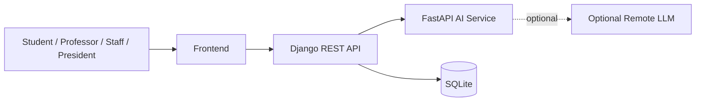
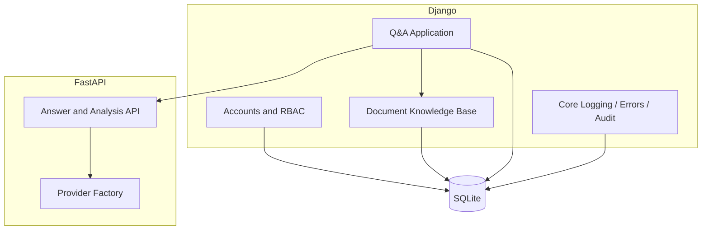
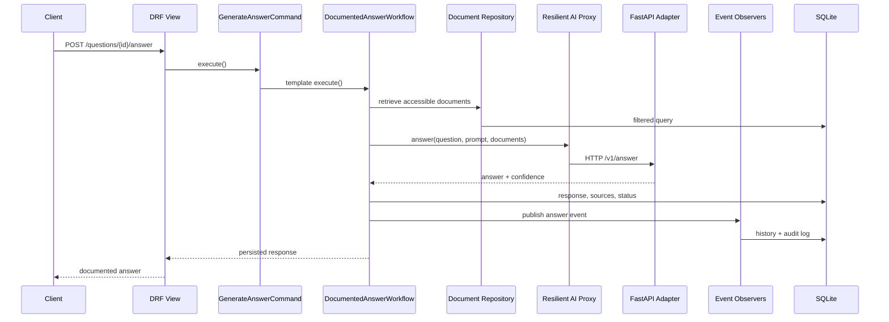
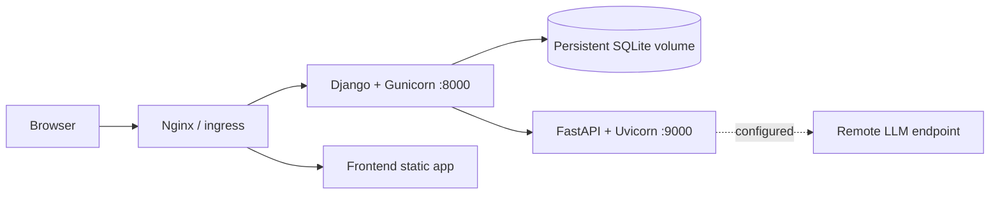

# 6. Software Architecture — Backend through Sprint 3

## 6.1 Architectural design decisions

### ADR-001 — Keep Django REST Framework as the core backend
The repository already uses Django and Django REST Framework. Replacing the backend with Express during Sprint 1 would introduce an unnecessary rewrite and split the domain model across frameworks. Django remains the system of record for users, RBAC, documents, questions, audit logs, and workflow state.

### ADR-002 — Isolate AI behind a service boundary
AI inference and request analysis are exposed by an independent FastAPI service. The Django application owns authorization, document access, persistence, status transitions, and audit history. The AI service never receives documents that the authenticated user is not allowed to access.

### ADR-003 — Use SQLite through Sprint 3
SQLite satisfies the sprint requirement and keeps local setup deterministic. ORM boundaries and repository classes avoid embedding SQLite-specific SQL in business services, allowing later migration to PostgreSQL.

### ADR-004 — JWT access and refresh tokens with revocation
Access tokens are short-lived. Refresh tokens are rotated and blacklisted on logout. A logout request therefore ends the refresh session instead of returning a cosmetic success response.

### ADR-005 — Permission-based RBAC
Roles aggregate explicit permissions. Views check permission codes rather than scattering role-name conditionals. System roles are seeded idempotently: Student, Professor, AdministrativeStaff, and UniversityPresident.

### ADR-006 — Document access is enforced before AI retrieval
All list, detail, search, and Q&A retrieval paths use the same access-filtered repository. Role-restricted documents cannot leak through the AI context path.

### ADR-007 — Synchronous Q&A processing for Sprint 3
Answer generation is synchronous because the backlog requires an immediately testable increment. The workflow is encapsulated so a later sprint can dispatch the same command to Celery/RQ without changing API or domain models.

### ADR-008 — Deterministic offline AI provider plus remote provider extension
The FastAPI service includes a deterministic document-grounded provider for local development and automated testing. A remote LLM provider is selected through environment configuration. The provider interface keeps vendor details outside the Django domain.

### ADR-009 — Soft deletion for users and documents
Users are deactivated and documents are archived. This preserves referential integrity, Q&A source history, and auditability.

### ADR-010 — Standard response and exception contracts
Successful responses use `{success, message, data}`. Errors use `{success, message, errors}`. A request ID is returned in `X-Request-ID` and included in logs.

## 6.2 Architectural views

### Context view



### Container view



### Component view — documented answer flow



### Deployment view



## 6.3 Architectural patterns

### Primary architectural patterns

| Pattern | Use in the system |
|---|---|
| Layered architecture | Views/serializers, application services, domain models, repositories/adapters |
| Service-oriented / microservice-oriented | Django operational service and independent FastAPI AI service |
| Repository | Centralized document access and search queries |
| Service layer | User, document, audit, and question use cases |
| DTO / serializer | Validation and API representation boundaries |
| Dependency inversion | Q&A workflow depends on provider/retrieval interfaces, not HTTP details |
| Event-driven domain notifications | Question events synchronously update history and audit logs |
| Soft-delete lifecycle | Deactivation/archive instead of destructive deletion |

### Required GoF design patterns

| Category | Pattern | Concrete implementation | Runtime purpose |
|---|---|---|---|
| Creational | Singleton | `apps.core.services.ServiceRegistry` | One registry instance for infrastructure services |
| Creational | Factory Method | `AIProviderFactory`, `DocumentRepositoryFactory`, `UserFactory`, `LLMProviderFactory` | Select/create implementations without coupling callers |
| Creational | Builder | `PromptBuilder`, AI `ResponseBuilder` | Construct prompts and documented responses step by step |
| Structural | Adapter | `FastAPILLMAdapter` | Translate FastAPI JSON into backend domain objects |
| Structural | Proxy | `ResilientAIProxy`, `DocumentAccessProxy` | Add retries/failure isolation and enforce access before retrieval |
| Structural | Decorator | `@audited` | Add audit behavior around document service operations |
| Behavioral | Observer | `QuestionEventPublisher` with history/audit observers | Persist processing events without coupling workflow to observers |
| Behavioral | Strategy | `KeywordKnowledgeRetrievalStrategy`, `KeywordRequestAnalysisStrategy`, `SQLiteDocumentSearchStrategy` | Swap retrieval, analysis, and search algorithms |
| Behavioral | Template Method | `AnswerGenerationTemplate` / `DocumentedAnswerWorkflow` | Define invariant Q&A stages with replaceable steps |
| Behavioral | Command | `LoginCommand`, `LogoutCommand`, `GenerateAnswerCommand` | Encapsulate application operations and their error behavior |

The patterns are invoked by production code and covered indirectly or directly by API tests; they are not unused demonstration classes.

## 6.4 Application architectures

### Django application architecture

```text
HTTP request
  -> URL routing
  -> DRF view + permission guard
  -> serializer validation
  -> command/application service
  -> domain workflow
  -> repository/proxy/adapter
  -> Django ORM
  -> standardized response
```

Django apps:

- `core`: request IDs, logging, error responses, audit model and service registry.
- `accounts`: authentication, users, departments, profiles, roles, permissions, and account commands.
- `documents`: knowledge-base model, access proxy, search strategies, document services, and audit decorator.
- `qa`: questions, responses, history, request analysis, retrieval, prompt building, AI adapter/proxy, workflow template, command, and observers.

### FastAPI application architecture

```text
FastAPI endpoint
  -> Pydantic request contract
  -> provider factory
  -> local grounded or remote LLM provider
  -> response builder
  -> Pydantic response contract
```

### Security architecture

- JWT authentication is the default for all private endpoints.
- Refresh tokens are blacklisted on logout.
- Failed logins increment a counter and temporarily lock the account.
- RBAC is checked on the server; frontend role checks are not trusted.
- Document visibility is filtered before detail access and AI context retrieval.
- A user cannot retrieve another user's question unless granted `questions.view_all`.
- Sensitive changes create immutable audit records.
- Passwords use Django's configured password hashers and are never serialized.

### Data ownership

| Data | Owning service |
|---|---|
| Users, roles, permissions, departments, profiles | Django |
| Documents and access rules | Django |
| Questions, answers, histories, source relations | Django |
| Audit logs | Django |
| Prompt processing and request classification | FastAPI |
| Optional remote model output | External provider through FastAPI only |
